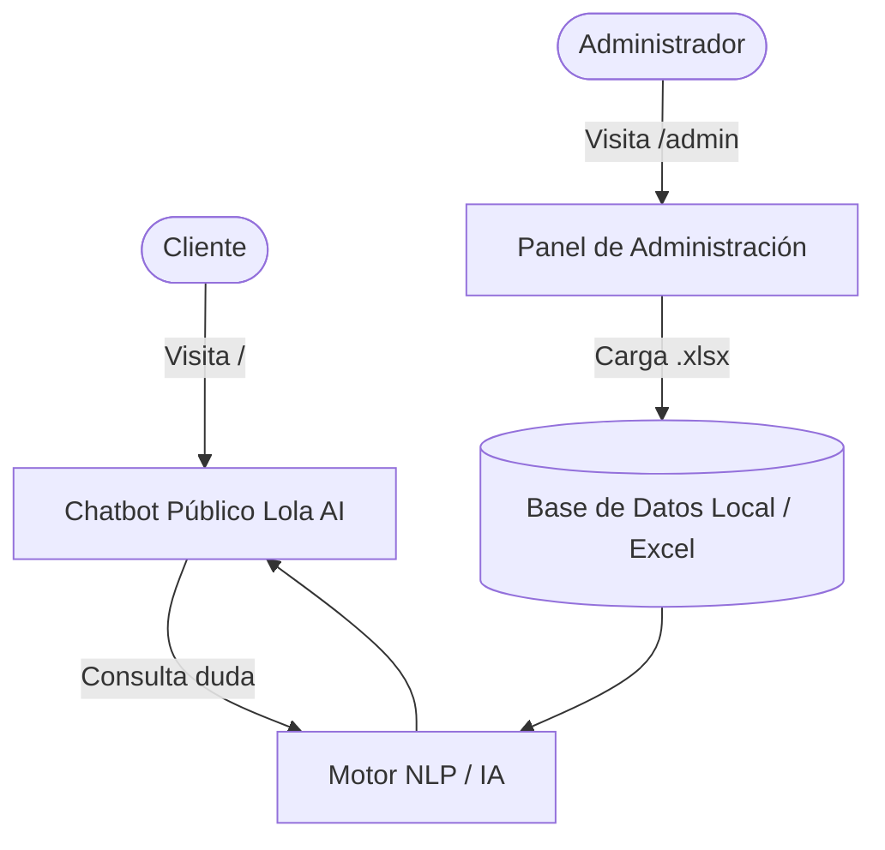

# Lola AI 🎀 | Documentación Técnica & Manual de Uso del Chatbot

Documento detallado sobre propósito, opciones funcionales, arquitectura, stack tecnológico y herramientas del chatbot corporativo.

---

## 1. ¿Para qué sirve este Chatbot?

**Lola AI** es una solución integral de atención al cliente y asistente de ventas virtual para empresas con enfoque de marca estético (*girlie/cute*), como boutiques de moda, marcas de belleza y skincare, cafeterías temáticas, tiendas de regalos o ecommerce.

### Objetivos y Beneficios de Negocio
* **Atención al Cliente 24/7**: Responde al instante dudas recurrentes de los clientes sobre horarios, dirección física, políticas de cambio, tiempos y costos de paquetería sin requerir un operador humano continuo.
* **Asesora de Ventas y Consulta de Catálogo**: Conoce el inventario completo cargado desde Excel (productos, descripciones, tallas, colores, precios en MXN y existencias en stock).
* **Cero Costo Operativo Obligatorio**: Incluye un motor inteligente local que funciona **100% gratis y sin claves de API**, con opción de activar modelos de lenguaje avanzados (Groq / Gemini) para respuestas conversacionales de alta fluidez.
* **Fidelización y Experiencia de Marca**: Su diseño *aesthetic* genera una conexión cálida y agradable con los compradores mediante micro-interacciones (sonidos sutiles, confeti reactivo, botones con animación flotante).
* **Fácil Administración Sin Código**: El dueño o equipo del negocio actualiza preguntas y productos editando una simple hoja de cálculo en Excel.

---

## 2. Separación de Rutas (Pública vs. Privada)

El sistema opera bajo una arquitectura de rutas separadas para garantizar la privacidad y seguridad:

| Ruta | Audiencia | Funcionalidad |
| :--- | :--- | :--- |
| **`/`** | **Clientes / Público** | Interfaz limpia y profesional de chat. No muestra pestañas ni controles administrativos. Acceso a chips de preguntas rápidas, respuestas formateadas y sonidos. |
| **`/admin`** | **Administrador** | Panel de control privado. Carga y descarga de Excel, CRUD de preguntas, personalización visual, conexión de IA y código para embeber en tiendas. |



---

## 3. Opciones y Módulos del Sistema

### A. Gestión de Información vía Excel
* **Carga Drag & Drop**: Admite archivos `.xlsx`, `.xls` y `.csv`.
* **Detección Flexible de Columnas**: Identifica encabezados estándar (`Pregunta`, `Respuesta`, `Categoría`, `Palabras Clave`) o encabezados de catálogo de productos (`Producto`, `Precio`, `Stock`, `Descripción`).
* **Plantilla Descargable con 1 Clic**: Genera automáticamente el archivo `plantilla_catalogo_y_preguntas_empresa.xlsx` con más de 20 ejemplos precargados.
* **Exportación de Datos**: Permite descargar la base de datos activa de nuevo a Excel en cualquier momento.
* **Modo Adición o Sobrescritura**: Posibilidad de reemplazar toda la base o anexar nuevos productos al catálogo existente.

### B. Catálogo de Inventario Integrado
El chatbot viene pre-configurado con un catálogo completo para Boutique & Café:
1. **Ropa & Moda Coquette**: Vestidos, blusas románticas, faldas preppy, cardigans y pijamas de satín (con tallas y existencias).
2. **Bolsos & Accesorios**: Bolsos corazón acolchados, mini mochilas, sets de moños coquette y termos de acero inoxidable.
3. **Calzado & Sneakers**: Tenis plataforma chunky con números mexicanos.
4. **Belleza & Skincare**: Serums de flor de cerezo con ácido hialurónico, mascarillas labiales hidratantes y body mist.
5. **Boutique Café**: Bebidas de especialidad rosa (Pink Velvet Latte con glitter, Strawberry Matcha) y repostería artesanal (Macarons, Croissants).

### C. Motor Inteligente de Respuestas (Híbrido)
1. **Modo Local Inteligente (Por Defecto - 100% Gratis)**:
   * Funciona sin conexión a servicios de pago ni claves de API.
   * Filtra tokens de forma estricta evitando falsos positivos.
   * Maneja saludos, agradecimientos y consultas de catálogo automáticamente.
2. **Conexión de IA Generativa con Auto-Descubrimiento (Self-Healing)**:
   * **Groq Cloud**: Integración con modelos Llama 3.1 8B, Qwen y OpenAI OSS. Si un modelo genera error de acceso, el sistema **consulta en caliente la API de Groq (`/openai/v1/models`), detecta los modelos habilitados en la cuenta y reintenta la respuesta sin fallos**.
   * **Google Gemini**: Compatible con `gemini-1.5-flash` desde Google AI Studio.
   * **OpenRouter**: Compatible con modelos abiertos gratuitos (`:free`).
   * **OpenAI**: Compatible con `gpt-4o-mini`.
   * **Botón de Diagnóstico en Tiempo Real**: Prueba la clave en 1 segundo y reporta latencia en milisegundos.

### D. Personalización Estética (Girlie System)
* **4 Paletas de Color Pastel**: Fresa Rosé (`#ff65a3`), Lavanda Chic (`#a855f7`), Melocotón Dulce (`#fb7185`) y Menta Chic (`#14b8a6`).
* **Selector de Avatar**: Emojis dedicados (🎀, 🐱, 🐰, 👑, 🌸, 💖, ☕, 🍓) o URL de imagen/logo propio.
* **Edición de Textos**: Nombre del bot, empresa, mensaje de bienvenida y mensaje cuando no se localiza un producto (*fallback*).

### E. Integración Web & Tiendas Online
* Generador de código `<iframe />` para insertar el chatbot como burbuja o ventana dentro de:
  * **Shopify**
  * **WordPress / WooCommerce**
  * **Webflow / Wix**
  * Sitios web en HTML/React/Next.js.

---

## 4. Stack Tecnológico & Herramientas

| Herramienta / Tecnología | Versión / Tipo | Propósito en el Proyecto |
| :--- | :--- | :--- |
| **Vite** | `v8.3.3` | Bundler y servidor de desarrollo ultra ligero y veloz. |
| **React** | `v19.x` | Librería UI para manejo reactivo del estado del chat y administración. |
| **SheetJS (`xlsx`)** | `v0.18.5` | Motor cliente para parsear, procesar y generar archivos Excel `.xlsx` directamente en el navegador. |
| **Vanilla CSS Design System** | CSS Moderno | Sistema de tokens CSS personalizados (`--primary`, glassmorphism, gradientes pastel, sombras suaves y tipografías Quicksand y Plus Jakarta Sans). Sin dependencias pesadas como Tailwind. |
| **Web Audio API** | Nativo de navegador | Generación sintética de ondas sinusoidales para sonidos (*chime*, *pop*, *sparkle*) sin requerir descarga de archivos MP3 externos. |
| **Canvas Confetti** | `v1.9.4` | Animaciones de partículas y confeti rosa al recibir reacciones de amor o guardar cambios. |
| **Lucide React** | `v1.16.0` | Paquete de iconografía vectorial limpia y estilizada. |
| **Vercel** | Producción | Plataforma de alojamiento en la nube con soporte SPA (`vercel.json` rewrites) y despliegue global CDN. |

---

## 5. Mantenimiento y Comandos de Despliegue

### Entorno Local
```bash
# Iniciar servidor de desarrollo
npm run dev

# Compilar paquete de producción
npm run build
```

### Actualización en Vercel
El proyecto está vinculado al equipo `jairdevs-projects` en Vercel:
```bash
# Desplegar directamente a producción
npx vercel deploy --prod --yes
```

---

## 6. Enlaces Directos del Proyecto

* **Producción Chatbot**: [https://cute-bot-ten.vercel.app/](https://cute-bot-ten.vercel.app/)
* **Panel de Administración**: [https://cute-bot-ten.vercel.app/admin](https://cute-bot-ten.vercel.app/admin)
* **Repositorio Local**: `/home/devjair06/.gemini/antigravity-ide/scratch/cute-bot`
